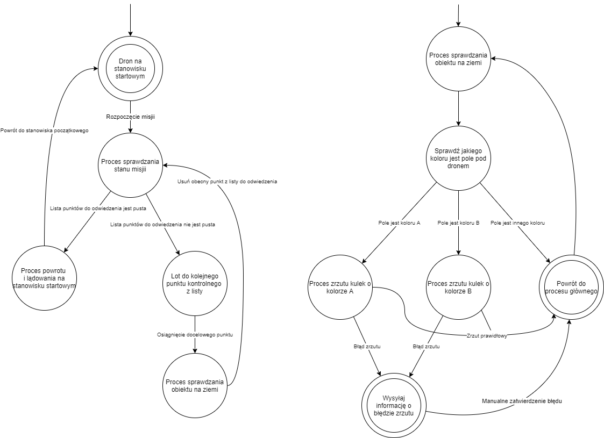

# Projekt TS 2021
## Temat: Proces sprawdzania i oznaczania obiektów przez UAV
## Członkowie grupy:
- Weronika Leśna
- Łukasz Kozak
## Schemat procesu:

### ToDo
- [x] Python state machine - konsolowo - przeskakiwanie po stanach 
- [x] Znaleźć projekt z symulacją UAV - https://ardupilot.org/dev/docs/ros-gazebo.html
- [ ] Stałe ze StateMAchine.py do YAML-a 
- [ ] plt.figure - przekazywać AX (na nowo ładowane grafu)
